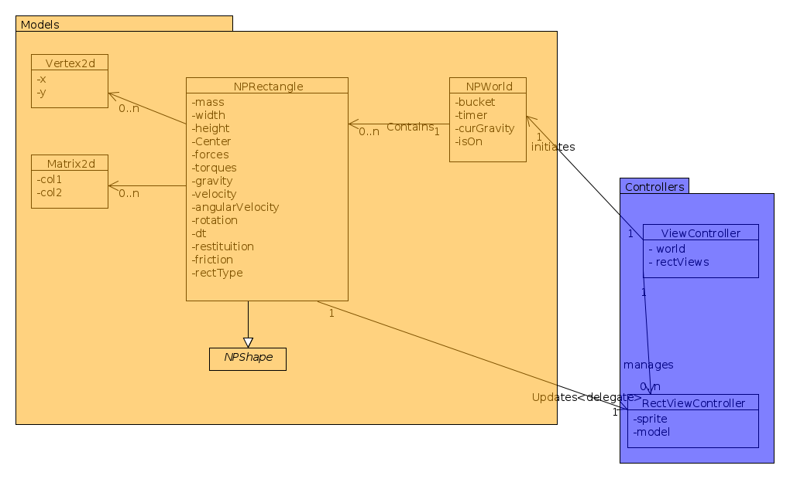
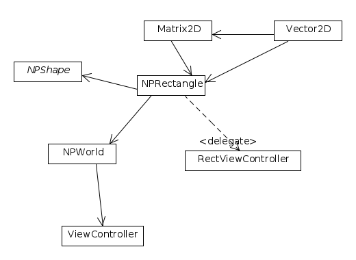

### Design
See that diagrams for more info!

On extending to more shapes:
Newton uses an abstract class called NPShape, which new Shapes are meant to extend. Any new shape has to implement a method updateSelfWith:(NPShape*)other.
So, if I were to add a Circle, I would simply make a class NPCircle and implement the collision detection and impulse wada wada, triggered by updateSelfWith:(NPCircle*)other and updateSelfWith:(NPRectangle*)other. Implementing the circle-rectangle collision would be NPCircle's responsibility.

### Testing

####Black-box Testing:

TestGravity:
- Two Rectangles, (created by default) must accelerate down
- However the walls must remain stationary

TestAccelerometer:
- Moving the angle of the ipad, changes the acceleration of objects.
- Make sure the orientation of the accleration is correct.

TestCollision Between an Object and a Wall:
- Object must not fall through the wall
- Object must have impulse applied on contact points
- Object must translate appropriately
- Object must also rotate appropriately

TestCollision Between Two Objects:
- Objects must not phase through
- Objects with lower mass should show greater movement
- Objects with higher restituition should be bouncier

TestCollisions Between Three Objects:
- Objects should interact without getting laggy
- Should not phase through each other

TestCollisions Between Three Objects and the Wall:
- Wall should not move
- Objects should not phase through the wall
- Objects shoud eventually slow down

TestPause:
- Single Tap once pauses the game.
- Another Single Tap continue it.
- All objects should continue normal behaviour

TestPinchInsert:
-Pinch to zoom should add a new Rectangle with random color and size

TestReset:
- Double Tap should rmeove all objects (except walls) from View

####GlassBox Testing:
TestCollisionDetection:
- clippingWith should return collision:NO if there's no overlapping.

TestApplyImpulse:
- Upon collision, normal and tangential impulses must spring into action.
- Blocks should not phase through each other
- Blocks should not overlap with walls.

TestRefEdge:
- Check the current Reference edge has been chosen

TestIncidenceEdge:
- Check the incident Edge is the correct Edge type.

TestContactPoints:
- For Overlapping Rectangles test if contact points are approximately accurate

#### Unit Testing
#####NPRectangle
testNegativeFVectors:
- test checkNegativeComponents method
testClipping:
- test collision detection, for cases of overlapping and non overlapping rects

testContactPointsE1:
- Test contact points are correct for E1 ref edge

testContactPointsE2:
- Test contact points are correct for E2 ref edge

testContactPointsE3:
- Test contact points are correct for E3 ref edge

testContactPointsE4:
- Test contact points are correct for E4 ref edge

### Bonus Questions
a) 4 - 5 days
b) CHECKED MY EQUATIONS A MILLION TIMES!!
c) Some of the equations aren't that clear about special cases. For example I discovered kinda last minute that cases with positive separation had to be excluded
